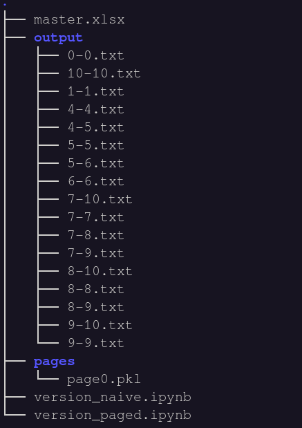
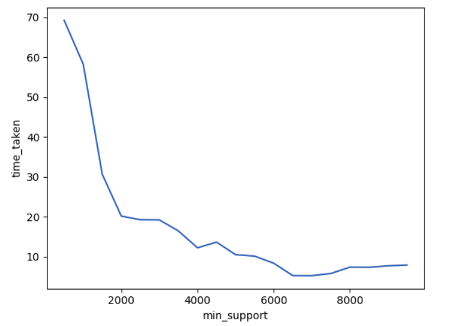
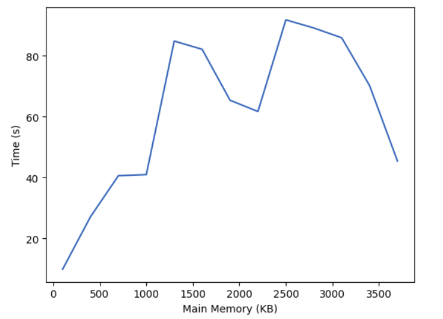

# Extracting data CUBE with BUC algorithm

* Implementation of BUC from the paper  
  * [1]Beyer, Kevin, and Raghu Ramakrishnan. "Bottom-up computation of sparse and iceberg cube." Proceedings of the 1999 ACM SIGMOD international conference on Management of data. 1999.
  * https://dl.acm.org/doi/pdf/10.1145/304182.304214 

## File structure

* master.xlsx is the given excel file
* output contains the aggregated values and count, where the aggregates are separated by "  ~  " 
* "start-end.text" represents the group by is done for columns numbered from start to end
* pages directory contains all the pages that are preprocessed before restricting the memory
* There are two version that are implemented, one is with paging while the other one is without paging

   

## Graphs

* Varying min_support keeping the memory practically unlimited compared to the file size of the excel file

   

* Varying the memory keeping the constant min_support of 500.

